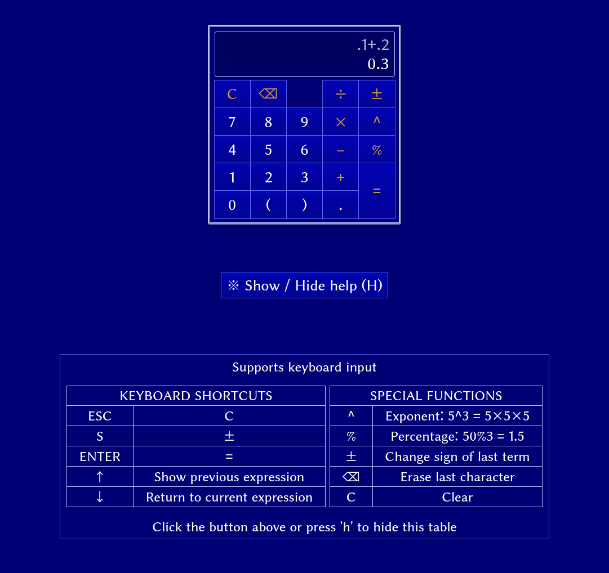

# Calculator
A calculator made as part of [The Odin Project's web development
101
course](https://www.theodinproject.com/courses/web-development-101/lessons/calculator).

## Usage

- Visit [this page](https://lcyne.github.io/calculator/) and try it out

## Structure

The project follows the structure explained in [this MDN
article](https://developer.mozilla.org/en-US/docs/Learn/Getting_started_with_the_web/Dealing_with_files).
- [scripts/main.js](./scripts/main.js): the script, essentially in 2 parts.
	* input: each newly inputted digit/dot/parenthese/operator is checked against
		the rest of the inputted expression by `updateExpr()`, in order to prevent
		invalid things like several operators in a row, excessive closing
		parentheses, multiple dots in a single number, etc.
	* calculations: the inputted expression is parsed as a string and PEMDAS is
	  repeatedly applied until we get a number with `calculateExpression()`

	Almost everything else is regexes or functions to deal with all the cases, so
	looking at those 2 functions first is a good way to grasp the code.
- [styles](./styles/): [Eric Mayer's CSS
  reset](https://meyerweb.com/eric/tools/css/reset/) and my own CSS
- [index.html](./index.html): all the HTML code

## License

This project is licensed under the [MIT license](./LICENSE).
